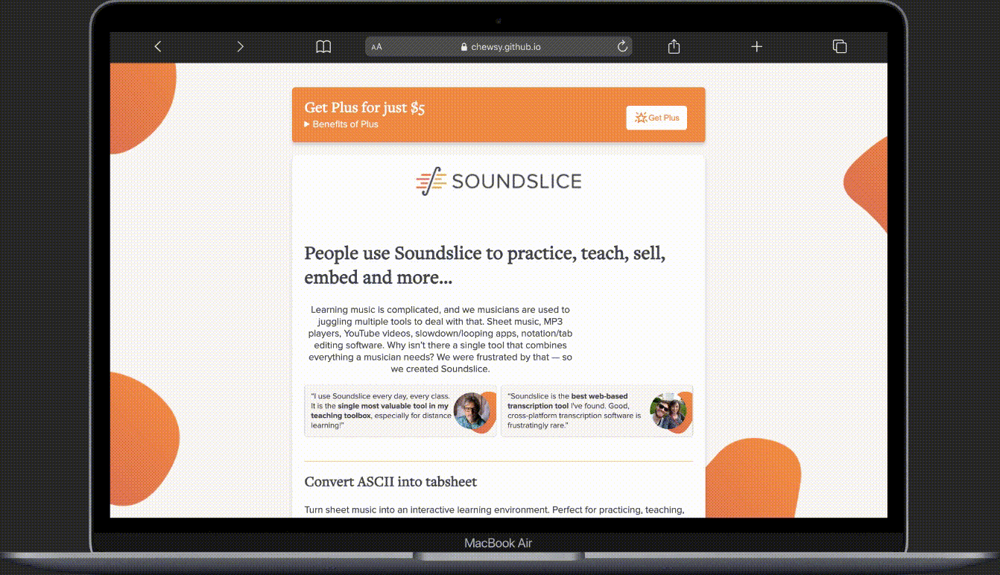
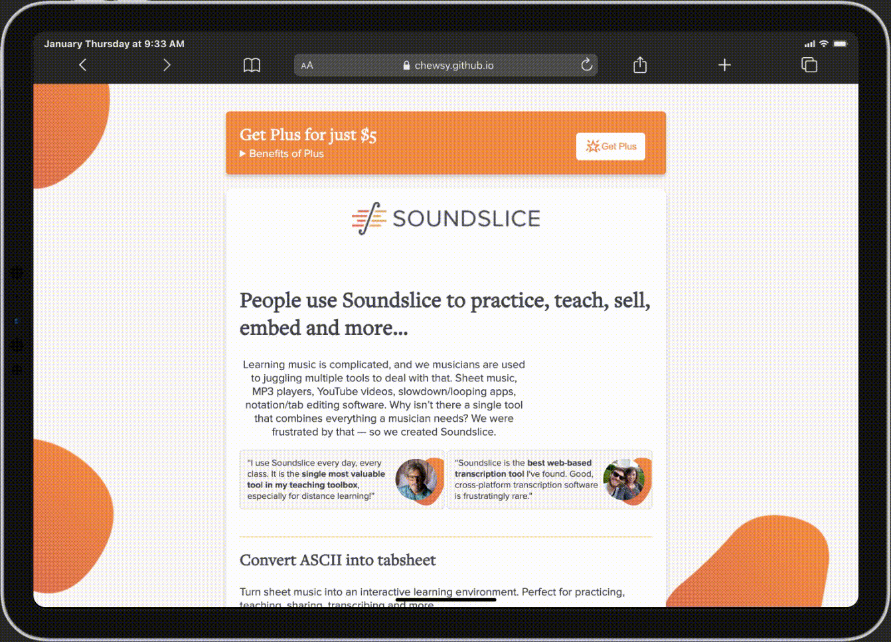
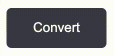
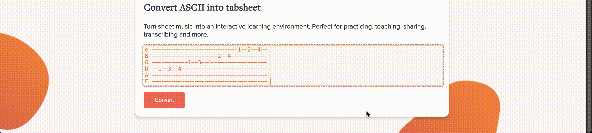
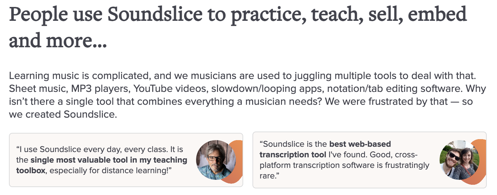

# SoundSlice Standalone ASCII converter

### Live link
https://chewsy.github.io/the-startup-responsive-interactive-website/  


### Mockups of different screen dimensions




## About the project
The client has requested a standalone website that allows users to convert ASCII tabs, whether text or supported file formats, into proper musicsheet. The user has the option to save if logged in and play back converted ASCII. The second focus-point of the website is the marketing. The goal is to drive unique visitors to SoundSlice in order to increase registered users, resulting in a further increase in subscriptions and word-of-mouth marketing.

## Features breakdown and reports
<a name="implemented-features"></a>
**The following elements and components are implemented:**

- [An input field for the ASCII converter with button](#converter)
- [An iframe player output with controls and save option](#results)
- [A call to action for visitors to get a subscription](#ad)
- [SEO and Accessibility](#seo)
    - [Lighthouse reports](#reports)

### converter
The converter consists of a required input field for the user to paste ASCII in which then gently guides the user through the process by using both a feedback and feedforward technique applied to the "Convert" button with an animation and styling that implies a button is now clickable.



This animation and condition checking was achieved by using CSS
```
#converter:has(textarea:not(:placeholder-shown)) button {
    background-color: var(--button-color);
    animation-name: schudden;
    animation-duration: .1s;
    animation-iteration-count: 6;
    animation-timing-function: ease-in-out;
    animation-direction: alternate;
}
```

```
@keyframes schudden {
    0% {
        rotate: -2deg;
    }

    100% {
        rotate: 2deg;
    }
}
```
<hr>

### results
After converting, an iframe embed with the converted ASCII is visible. By using Soundslice's music notation software, the user can interact with the iframe and use its many useful features and controls to practise.

The user is also given the button "Save to library" to save the musicsheet to their account if logged in (tracked by cookies) and if not, the user gets redirected to the signing up page on the official domain.



The displaying of the converted section including iframe and button is achieved with JavaScript.

```
document.querySelector("#convertButton").addEventListener("click", function (event) {
    const asciiInput = document.querySelector("#ascii");
    console.log(asciiInput);
    if (asciiInput.value !== "") {
        event.preventDefault();
        document.querySelector("#result").style.display= "block";
    }
});
```

An animation delay is applied to the "Save to library" option as the user would be given a lot of information and content on screen which takes a few seconds to process.

`animation-delay: 3s;`

<hr>

### ad
On medium and large screensizes, the call to action for the user to subscribe to a plan is put at the top in the form of an expandable banner. Upon expanding the user is shown the perks of purchasing the Plus plan.


The reasoning for only displaying the $5 plan is because the target audience exists of individuals who most likely do not have access to professional music notation tools and practise songs with ASCII musicsheets, no teachers or music institutes thus there being less need to advertise the more advanced plans.

<hr>

### seo
The Search Engine Optimization on this page consists of strong keywords extracted from the official Soundslice website in the form of a paragraph about Soundslice and user reviews.



#### reports:
-   a SEO score of 100%
-   a performance score of 94%
-   an accesibility score of 92%  
*(Only point of concern is the contrast between the colors from the Soundslice colorpalet)*


## Sources

## License

This project is licensed under the terms of the [MIT license](./LICENSE).


